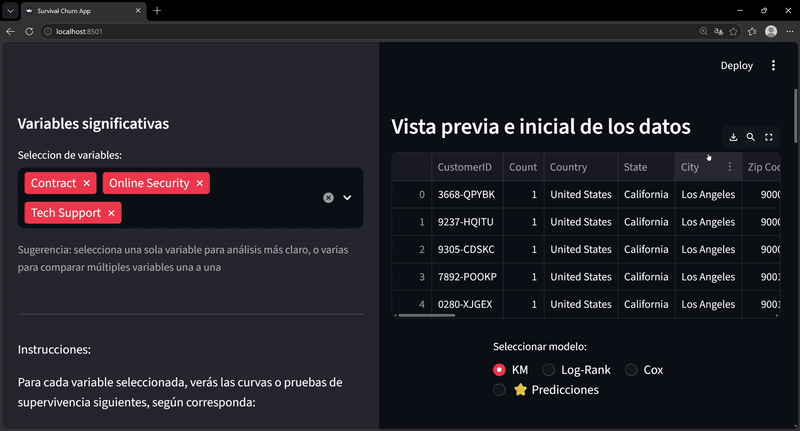
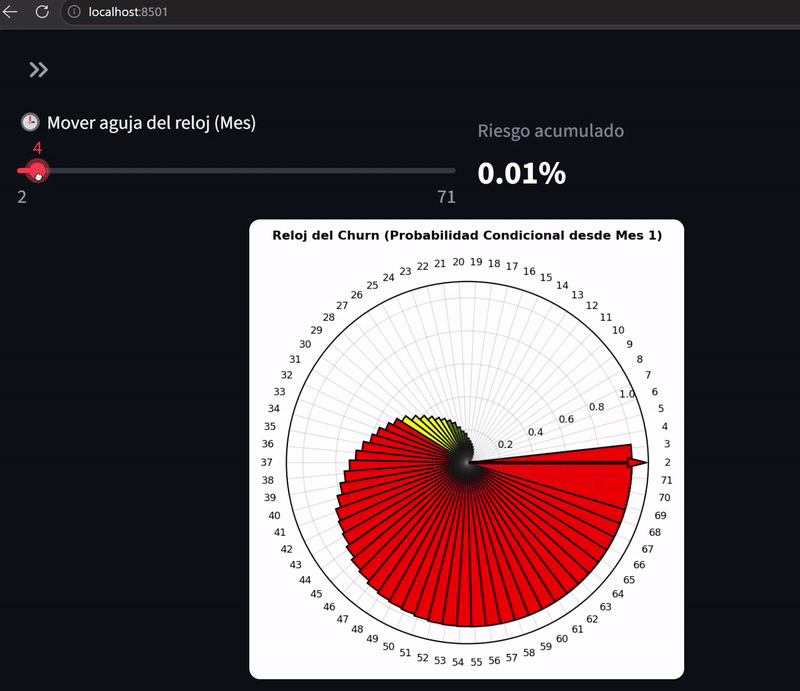

# Survival-Churn-Analysis




## ¿Por qué utilizar Análisis de Supervivencia para Churn?

A diferencia de los enfoques tradicionales de clasificación binaria (como Regresión Logística o Random Forest), este modelo implementa **Análisis de Supervivencia** por las siguientes ventajas competitivas:

* **Manejo de Censura de Datos:** Permite incluir en el análisis a clientes activos que aún no han cancelado el servicio, evitando los sesgos que generarían arquitecturas como Redes Neuronales.
* **Predicción Temporal Dinámica:** No se limita a predecir *si* un cliente abandonará, sino *cuándo* ocurrirá el evento, superando la naturaleza estática de la Regresión Logística.
* **Evolución del Riesgo:** Facilita la comprensión de cómo cambia la probabilidad de abandono a lo largo del tiempo en lugar de segmentar con salidas rígidas de 0 o 1.
* **Cálculo Preciso de Customer Lifetime Value (CLV):** Define de forma exacta el tiempo de vida esperado del cliente, una métrica que algoritmos de Boosting no logran delimitar con precisión nativa.

## Guía de Uso (CLI)

Ejecutar el análisis principal (modo silencioso):
```bash
python Survival-Churn-app/models.py
```

Generar y guardar gráficos en el directorio por defecto (`plots/`):
```bash
python Survival-Churn-app/models.py --save-plots
```

Ejecutar visualización interactiva de gráficos:
```bash
python Survival-Churn-app/models.py --show-plots
```

Guardar resultados en un directorio personalizado:
```bash
python Survival-Churn-app/models.py --save-plots --outdir results/figuras
```

> **Nota:** El script localiza el dataset (`Telco_customer_churn.csv`) mediante rutas relativas al archivo de ejecución.

## Despliegue en Render (Streamlit)

El proyecto está configurado para producción en **Render** mediante el archivo `render.yaml` o con la siguiente configuración manual:

* **Build Command:** `pip install -r requirements.txt`
* **Start Command:** `streamlit run app.py --server.port $PORT --server.address 0.0.0.0`


Notas:
- Render exige escuchar en `0.0.0.0` y en el puerto indicado por `PORT` (por defecto 10000).
- También puedes usar el archivo `render.yaml` incluido en la raíz del proyecto.
